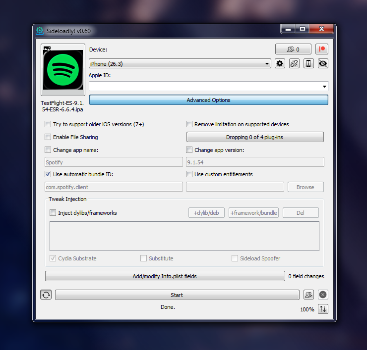

# EeveeSpotifyReincarnated 

**Updated and maintained by [jaydenjcpy](https://github.com/jaydenjcpy) & [faroukbmiled](https://github.com/faroukbmiled), prebuilt by [estrogencat](https://github.com/estrogencat)**

**Last updated `00/00/00` (DD/MM/YY) Current TestFlight BETA Version `0.0.00.0000` - Current Stable Version `9.1.48`**

I created this repository a while back, as I didn't fully trust whoeevee's prebuilt IPAs (was new to the scene). 
Then, I noticed that people were using it for the IPAs so I made a Telegram channel and started posting them there too. Eventually, whoeevee stopped maintaining the [original EeveeSpotify](https://github.com/whoeevee/EeveeSpotifyReborn), so I had to switch to [Meeep1 or Skye's repository](https://github.com/Meeep1/EeveeSpotifyRevivedPublic). 
Then that started to break, as Skye had gone inactive, so I slowed down uploads until [Jayden forked Skye's repository](https://github.com/jaydenjcpy/EeveeSpotifyReincarnated) and fixed all of the issues that kept rising up. 
 And yes, the Sideloadly issue is fixed as of 07/06/26.
 

# Downloads

> [!WARNING]
> <h1><b>PLEASE READ <a href="Files/common_issues.md">COMMON ISSUES</a> BEFORE MAKING AN ISSUE ELSEWHERE, IT MIGHT HAVE A FIX FOR YOUR ISSUE(s).</b></h1> 
> There is a chance you will be ignored, either for a while, or completely, if you report an issue already widely known, so <b>please</b> read it. You'll save yourself time doing this.

  
<h3>Click to expand download links</h3>

  
###  Located in [Releases](https://github.com/estrogencat/EeveeIPA/releases) <nobr>or [the Telegram channel](https://t.me/eeveespotify_hazel)</nobr>

## Installation

For sideloaded IPAs, we recommend using **SideStore** or certificate-based signing tools like **Feather** for best compatibility.

For the PATCHED variant, only certificate-based signing tools or TrollStore can be used to install. For the REGULAR variant, any sideloading tool can be used, but [I](https://github.com/estrogencat) personally use SideStore

To open Spotify links in sideloaded app, use [OpenSpotifySafariExtension](https://github.com/BillyCurtis/OpenSpotifySafariExtension). Remember to activate it and allow access in Settings > Safari > Extensions.

inspired by [notdarkn's readme](https://github.com/NotDarkn/EeveeReincarnatedIPA/blob/Master/README.md)

  
<h3>Lesser needed info, keeping it here just in case</h3>

  
## Where the IPA is obtained from
1. I download Spotify from either the App Store or the TestFlight app
2. I use TrollDecrypt on my iPhone X, jailbroken with palera1n, and then upload the IPA to my own website
3. [nother repository is used to actually build the IPA, as this repository uses whoeevee's files. The action is modified for my own use, but you can still fork and use it as long as the secrets are filled in for the extra checkboxes **IF** you use them. build-and-release-yourself.yml is used, the deb is grabbed from Jayden's actions.

Prebuilt used to be tested BEFORE uploading, but as of June 2026 they are tested after aslong as there arent any breaking bugs reported. 
Regular & Patched IPAs are tested using an **iPhone 12** running **iOS `26.2`** with a **WSF Basic Certificate**.  

## Restrictions

Please refrain from opening issues about the following features, as they are server-sided and will **NEVER** work:

- Very High audio quality
- Native playlist downloading (you can download podcast episodes though)
- Jam (hosting a Spotify Jam and joining it remotely requires Premium; only joining in-person works)
- AI DJ/Playlist
- Spotify Connect (When using Spotify Connect, the device will act as a remote control and stream directly to the connected device. This is a server-sided limitation and is beyond the control of EeveeSpotify, so it will behave as if you have a Free subscription while using this feature.)

## Custom Lyrics Support

**Spotify 9.1.50 and above** - Full custom lyrics functionality is available with the following providers:

- **Musixmatch**
- **PetitLyrics**
- **LRCLIB**
- **Genius**

> [!NOTE]
> All providers work now

## The History

In **January 2024**, Spotilife, the only tweak to get Spotify Premium, stopped working on new Spotify versions. **[whoeevee](https://github.com/whoeevee)** decompiled Spotilife, reverse-engineered Spotify, intercepted requests, etc., and created this tweak.

In **December 2025**, whoeevee, the maintainer of the EeveeSpotify tweak at the time, announced he'll be discontinuing the tweak because of the burden of keeping up with Spotify's constantly changing architectures. Soon after, **[Meep1](https://github.com/Meeep1)**, forks the original Eevee repo and continues to develop the tweak to support newer Spotify versions, under the project name EeveeSpotiyRevivedPublic.

In **March 2026**, the latest EeveeSpotifyRevivedPublic release, v9.1.28, users experienced constant logging out issues and reported to Skye, however, at the time of this README.md written, EeveeSpotifyRevivedPublic hasn't released any newer updates. During March, I've been constantly annoyed by the logout issue and decided to take matters into my own hands and forked EeveeSpotifyRevivedPublic and fixed the logout issue, which will eventually lead to the creation of this repository, which will be continuing the legacy of EeveeSpotify for newer versions of Spotify.

## Lyrics Support

EeveeSpotify replaces Spotify monthly limited lyrics with one of the following four lyrics providers:

- Genius: Offers the best quality lyrics, provides the most songs, and updates lyrics the fastest. Does not and will never be time-synced.

- LRCLIB: The most open service, offering time-synced lyrics. However, it lacks lyrics for many songs.

- Musixmatch: The service Spotify uses. Provides time-synced lyrics for many songs, but you'll need a user token to use this source. To obtain the token, download Musixmatch from the App Store, sign up, then go to Settings > Get help > Copy debug info, and paste it into EeveeSpotify alert. You can also extract the token using MITM.

- PetitLyrics: Offers plenty of time-synced Japanese and some international lyrics.

If the tweak is unable to find a song or process the lyrics, you'll see a "Couldn't load the lyrics for this song" message. The lyrics might be wrong for some songs when using Genius due to how the tweak searches songs. While I've made it work in most cases, kindly refrain from opening issues about it.

## How It Works

EeveeSpotify intercepts Spotify requests to load user data, deserializes it, and modifies the parameters in real-time. This method works incredibly stable across supported Spotify versions.

The tweak also sets `trackRowsEnabled` to `true`, allowing you to see track rows and liked tracks on artist pages just like with Premium.

## Credits
Thanks for all of the community's support, also, thanks to all the devs who worked along with me to revive this project. Go check the other dev's out:

- EeveeSpotifyReincarnated

  - [Jayden](https://github.com/jaydenjcpy) - EeveeSpotifyReincarnated
  - [Ryuk](https://github.com/faroukbmiled) - True Shuffle, App Icon, Support for Spotify v9.1.46 and above 
  - [Mod-4](https://github.com/M0d-4) - Custom Lyrics, iPadUI fix 
  - [estrogencat](https://github.com/estrogencat) - Icon Fixes

- EeveeSpotify (OG)

  - [Skye](https://github.com/Meeep1) - EeveeSpotifyRevivedPublic, the base of this project 
  - [whoeevee](https://github.com/whoeevee) - EeveeSpotify & EeveeSpotifyReborn, where all this started

